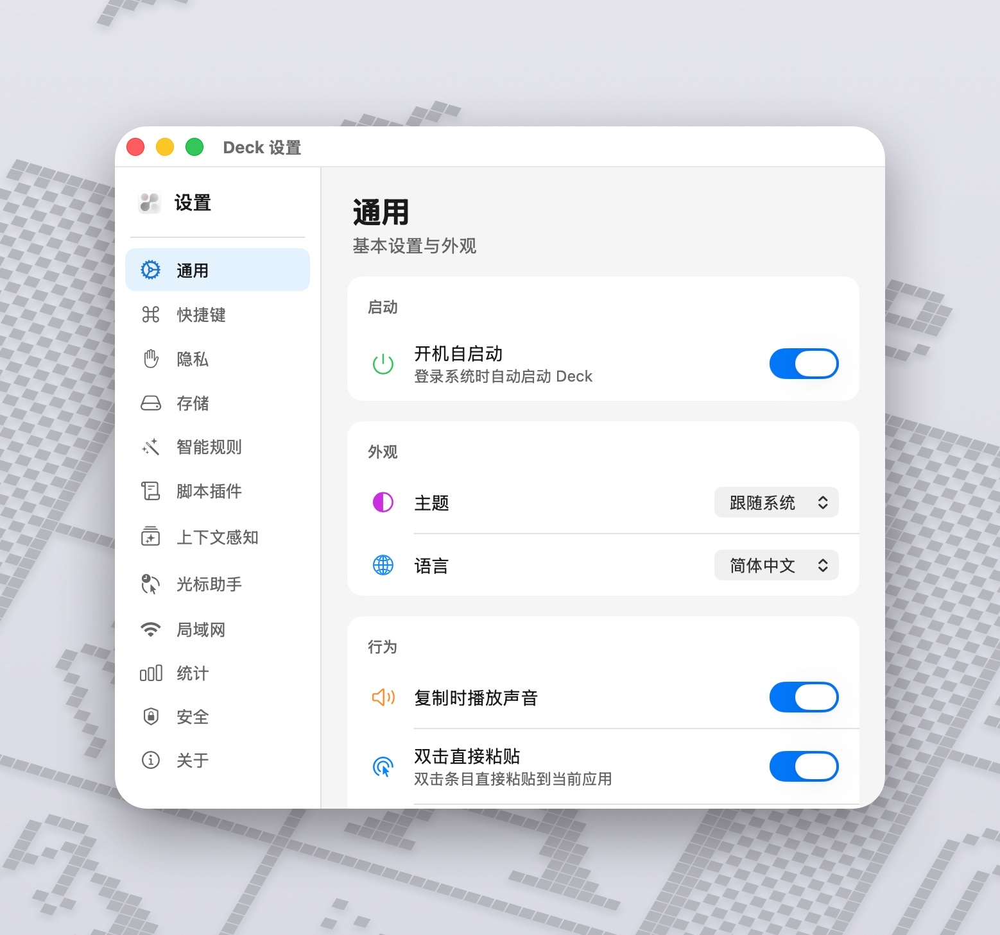

  <picture>
    <source media="(prefers-color-scheme: dark)" srcset="photos/deck-macOS-Dark-1024x1024@1x.png">
    <source media="(prefers-color-scheme: light)" srcset="photos/deck-macOS-Default-1024x1024@1x.png">
    
  </picture>

<h1 align="center">Deck</h1>

  <strong>A modern, native, privacy-first clipboard OS for macOS</strong>

  <a href="#features">Features</a> •
  <a href="#integrations">Integrations</a> •
  <a href="#install">Install</a> •
  <a href="#quick-start">Quick Start</a> •
  <a href="#screenshots">Screenshots</a> •
  <a href="#support-deck">Support</a> •
  <a href="#license">License</a> •
  <a href="#中文说明">中文</a>

  
  
  

---

## Features

### Clipboard History & Search

- Records text, images, files, colors, links, and rich text.
- Search by keyword, regex, or type — with on-device **semantic search** powered by NLEmbedding.
- Slash-triggered search rules: filter by app, date, or type (include/exclude, multi-value).
- Per-item custom titles — searchable, and synced across devices.
- Tags and smart categories.
- Context-aware ordering: items sorted by relevance to the current app.

### Smart Features

- **Smart Rules** — automated workflows with condition matching and actions, including JavaScript script plugins.
- **OCR** — automatically extracts text from images in the background (Vision framework, multi-language).
- **Cursor Assistant** — triple-tap Shift to get context-aware clipboard suggestions at your cursor, with trigger-word matching and template integration.
- **Template Library** — save reusable clipboard templates with color coding and cursor-position paste.
- **Text Transformations** — JSON format/minify, Base64, URL encode/decode, case conversion, timestamp parsing, MD5 hash, line sort/dedup, and more.
- **IDE Source Anchor** — copies from VS Code, Xcode, JetBrains, Cursor, or Windsurf automatically capture file path + line number; click to jump back.
- **Figma Detection** — recognizes Figma clipboard content with a dedicated preview.
- **Link Preview** with one-tap QR code generation.
- **Link Cleaner** — strips tracking parameters from URLs.
- **Instant Calculation** — copy a math expression, see the result immediately.
- **Smart Text Detection** — identifies emails, URLs, phone numbers, code language, JWT tokens, and more.

### Privacy & Security

- **Local-first** — your data stays on your Mac by default.
- **Touch ID / Face ID** unlock before opening the panel.
- **Sensitive data filtering** — auto-detects bank card numbers and identity/passport numbers via Luhn algorithm; skips capture.
- **Window-aware protection** — detects sensitive window titles (password fields, login pages) and pauses capture automatically.
- **Clipboard steganography** — embed hidden messages in images or zero-width text.
- **Screen share detection** — optionally hides the panel during screen sharing or recording.
- **Pause mode** — temporarily stop capturing with one click.

### Sync & Sharing

- **iCloud Sync** via CloudKit, with optional end-to-end encryption.
- **LAN Sharing** with AES-GCM encryption and TOTP verification.
- **Direct IP Connection** — connect to peers by IP address, bypassing VPN or Bonjour issues.

### Workflow

- **Queue mode** — paste multiple items in sequence.
- **Keyboard-first** design with optional Vim mode.
- **Typing paste** — type clipboard content character-by-character instead of pasting.
- **Siri Shortcuts** — query recent clipboard items via App Intents.
- **CLI Bridge** — local automation and external integrations from the terminal.
- **Data export** — export your clipboard history.
- **Usage statistics** — all computed locally, never uploaded.
- Migration from Paste, Maccy, CopyClip, and other clipboard apps.
- Auto updates with daily checks (or manual check in Settings).
- Missing-file warnings with auto-cleanup after closing the panel.

## Integrations

- **[Deck × Orbit](https://github.com/yuzeguitarist/Orbit)** — radial app switcher + file hub. Cursor ring, long-press trigger, drag-to-quit, file AirDrop/trash.

## Install

1. Download the latest `.dmg` from [Releases](https://github.com/yuzeguitarist/Deck/releases).
2. Drag `Deck.app` into **Applications**.
3. First launch: **Control-click** Deck → Open, then confirm.
4. Grant **Accessibility** (and **Input Monitoring** if prompted) in `System Settings → Privacy & Security`.

> Source is partially published; building the full app from source is not supported yet.

## Requirements

- macOS 14.0+
- Apple Silicon or Intel

## Quick Start

1. Launch Deck.
2. Press `Cmd + P` to open the panel.
3. Arrow keys to navigate, `Enter` to paste.

### Default Shortcuts

| Shortcut | Action |
|----------|--------|
| `Cmd + P` | Open Deck |
| `Enter` | Paste selected |
| `Shift + Enter` | Paste as plain text |
| `Cmd + Number` | Quick paste (1–9) |
| `Cmd + Q` | Toggle queue mode |
| `Space` | Toggle preview |
| `Esc` | Close |

- Start typing right after opening the panel to search.
- Scroll the mouse wheel on the history list to switch focus.

More shortcuts and Vim mode are in Settings.

## Screenshots

  

  

## Support Deck

  <strong>If Deck makes your day a bit smoother, consider supporting its development:</strong>

  

  International supporters → Ko-fi

  China mainland → WeChat Pay / Alipay

  

## Contributing

Contributions to the open-sourced parts are welcome! Please read the [Contributing Guide](CONTRIBUTING.md) before submitting a PR.

> All PRs must target the `dev` branch, not `main`.

## License

This project is **partially open source** under **GPL-3.0 with Commons Clause** — see [LICENSE](LICENSE).

**In short:**
- Free for personal, non-commercial use.
- You can modify the open-sourced modules.
- Derivatives must use the same license.
- Commercial use requires permission.

Questions or licensing inquiries → yuzeguitar@gmail.com

## Support

- [Report a Bug](https://github.com/yuzeguitarist/Deck/issues/new?template=bug_report.md)
- [Request a Feature](https://github.com/yuzeguitarist/Deck/issues/new?template=feature_request.md)
- [Discussions](https://github.com/yuzeguitarist/Deck/discussions)

---

# 中文说明

  <strong>一款原生、注重隐私的 macOS 剪贴板 OS</strong>

## 功能特性

### 剪贴板历史与搜索

- 记录文本、图片、文件、颜色、链接、富文本。
- 关键词、正则、类型筛选搜索，支持基于 NLEmbedding 的**语义搜索**（离线运行）。
- 斜杠 `/` 触发搜索规则：按应用、日期、类型过滤（支持排除与多值）。
- 每条记录可设置自定义标题，支持搜索，跨设备同步。
- 标签与智能分类。
- 上下文感知排序：根据当前应用自动调整剪贴板顺序。

### 智能功能

- **智能规则** — 条件匹配 + 动作执行的自动化工作流，支持 JavaScript 脚本插件。
- **OCR 文字识别** — 后台自动提取图片中的文字（基于 Vision 框架，支持多语言）。
- **光标助手** — 三连按 Shift 呼出，根据上下文推荐剪贴板内容，支持触发词匹配和模板联动。
- **模板库** — 保存常用剪贴板模板，支持颜色标记和光标位置粘贴。
- **文本转换** — JSON 格式化/压缩、Base64、URL 编解码、大小写转换、时间戳解析、MD5 哈希、行排序/去重等。
- **IDE 源码定位** — 从 VS Code、Xcode、JetBrains、Cursor、Windsurf 复制时自动记录文件路径和行号，点击即可跳回源码。
- **Figma 识别** — 自动识别 Figma 剪贴板内容，提供专用预览。
- **链接预览** — 一键生成二维码。
- **链接净化** — 自动移除 URL 中的跟踪参数。
- **即时计算** — 复制数学表达式，立即显示计算结果。
- **智能文本检测** — 识别邮箱、URL、电话号码、编程语言、JWT Token 等。

### 隐私与安全

- **本地优先** — 数据默认留在你的 Mac 上。
- **Touch ID / Face ID** 解锁面板。
- **敏感信息过滤** — 通过 Luhn 算法自动识别银行卡号和身份证/护照号，跳过记录。
- **窗口感知保护** — 检测到密码输入、登录页面等敏感窗口标题时自动暂停记录。
- **剪贴板隐写** — 在图片或零宽文本中嵌入隐藏信息。
- **屏幕共享检测** — 在屏幕共享或录屏时可自动隐藏面板。
- **暂停模式** — 一键暂停剪贴板记录。

### 同步与共享

- **iCloud 同步** — 基于 CloudKit，支持可选的端到端加密。
- **局域网共享** — AES-GCM 加密 + TOTP 验证。
- **直连模式** — 通过 IP 地址直接连接，绕过 VPN 或 Bonjour 限制。

### 工作流

- **队列模式** — 按顺序依次粘贴多条内容。
- **键盘优先**设计，可选 Vim 模式。
- **打字粘贴** — 逐字符输入剪贴板内容（适配不支持直接粘贴的场景）。
- **Siri 快捷指令** — 通过 App Intents 查询最近的剪贴板条目。
- **CLI Bridge** — 终端调用，用于本地自动化和外部联动。
- **数据导出** — 导出剪贴板历史。
- **使用统计** — 纯本地计算，不上传任何数据。
- 支持从 Paste、Maccy、CopyClip 等剪贴板应用迁移历史。
- 自动更新（每日检查 + 设置页手动检查）。
- 文件缺失提示，面板关闭后自动清理。

## 联动

- **[Deck × Orbit](https://github.com/yuzeguitarist/Orbit)** — 径向应用切换器 + 文件中转。鼠标附近呼出、长按触发、拖拽退出、文件 AirDrop/删除。

## 安装

1. 从 [Releases](https://github.com/yuzeguitarist/Deck/releases) 下载最新 `.dmg`。
2. 将 `Deck.app` 拖入 **Applications**。
3. 首次启动：按住 **Control** 点击 Deck → 打开。
4. 在 `系统设置 → 隐私与安全性` 中授予**辅助功能**（及可能的**输入监控**）权限。

> 当前仅部分源码公开，暂不支持完整从源码构建。

## 系统要求

- macOS 14.0+
- Apple Silicon 或 Intel

## 快速开始

1. 启动 Deck。
2. `Cmd + P` 打开面板。
3. 方向键选择，回车粘贴。

### 默认快捷键

| 快捷键 | 功能 |
|--------|------|
| `Cmd + P` | 打开 Deck |
| `Enter` | 粘贴选中项 |
| `Shift + Enter` | 粘贴为纯文本 |
| `Cmd + 数字` | 快速粘贴 (1–9) |
| `Cmd + Q` | 切换队列模式 |
| `Space` | 切换预览 |
| `Esc` | 关闭 |

- 打开面板后直接输入即可搜索。
- 在历史列表上滚动鼠标滚轮可切换聚焦条目。

更多快捷键与 Vim 模式详见设置。

## 截图

  

  

## 支持作者

  <strong>如果 Deck 对你有帮助，欢迎支持一下持续开发：</strong>

  

  微信 / 支付宝扫码赞助

  

  海外用户可通过 Ko-fi 赞助

## 参与贡献

欢迎为开源部分贡献代码！提交前请先阅读 [贡献指南](CONTRIBUTING.md)。

> 所有 PR 请提交到 `dev` 分支。

## 许可证

本项目为**部分开源**，采用 **GPL-3.0 + Commons Clause** 许可证 — 详见 [LICENSE](LICENSE)。

**简单来说：**
- 个人/非商业用途免费使用
- 可修改开源部分
- 衍生作品须使用相同许可证
- 商业用途需获得许可

如有疑问或授权需求，请联系：yuzeguitar@gmail.com

## 支持

- [报告 Bug](https://github.com/yuzeguitarist/Deck/issues/new?template=bug_report.md)
- [功能建议](https://github.com/yuzeguitarist/Deck/issues/new?template=feature_request.md)
- [讨论区](https://github.com/yuzeguitarist/Deck/discussions)

---

  Made by <a href="https://github.com/yuzeguitarist">Yuze Pan (潘禹泽)</a>

