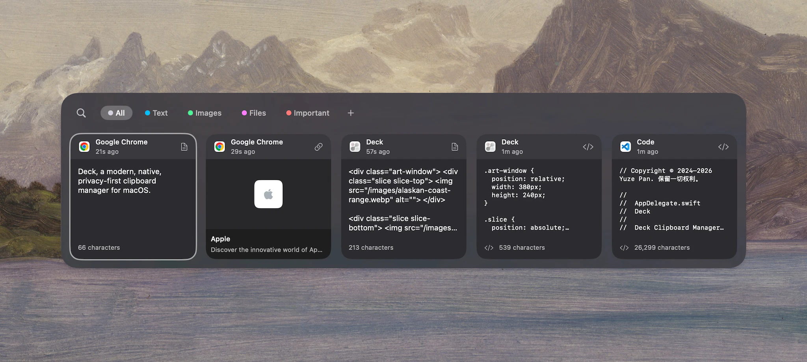

<a href="https://deckclip.app">
    
</a>

<p align="center">
  <a href="#features">Features</a> ·
  <a href="#install">Install</a> ·
  <a href="#quick-start">Quick Start</a> ·
  <a href="#integrations">Integrations</a> ·
  <a href="#screenshots">Screenshots</a> ·
  <a href="https://deckclip.app/docs">Docs</a> ·
  <a href="#support-deck">Support</a> ·
  <a href="#license">License</a> ·
  <a href="https://deckclip.app">Website</a> ·
  <a href="README_CN.md">中文</a>
</p>

<p align="center">
  <a href="https://deckclip.app">
    
    
    
  </a>
</p>

---

## Features

### Clipboard History & Search

- Records text, images, files, colors, links, and rich text.
- Search by keyword, regex, or type — with on-device **semantic search** powered by NLEmbedding.
- Slash-triggered search rules: filter by app, date, or type (include/exclude, multi-value).
- Per-item custom titles — searchable, and synced across devices.
- Tags and smart categories.
- Context-aware ordering: items sorted by relevance to the current app.

### Smart Features

- **Smart Rules** — automated workflows with condition matching and actions, including JavaScript script plugins.
- **OCR** — automatically extracts text from images in the background (Vision framework, multi-language).
- **Cursor Assistant** — triple-tap Shift to get context-aware clipboard suggestions at your cursor, with trigger-word matching and template integration.
- **Template Library** — save reusable clipboard templates with color coding and cursor-position paste.
- **Text Transformations** — JSON format/minify, Base64, URL encode/decode, case conversion, timestamp parsing, MD5 hash, line sort/dedup, and more.
- **IDE Source Anchor** — copies from VS Code, Xcode, JetBrains, Cursor, or Windsurf automatically capture file path + line number; click to jump back.
- **Figma Detection** — recognizes Figma clipboard content with a dedicated preview.
- **Link Preview** with one-tap QR code generation.
- **Link Cleaner** — strips tracking parameters from URLs.
- **Instant Calculation** — copy a math expression, see the result immediately.
- **Smart Text Detection** — identifies emails, URLs, phone numbers, code language, JWT tokens, and more.

### Privacy & Security

- **Local-first** — your data stays on your Mac by default.
- **Touch ID / Face ID** unlock before opening the panel.
- **Sensitive data filtering** — auto-detects bank card numbers and identity/passport numbers via Luhn algorithm; skips capture.
- **Window-aware protection** — detects sensitive window titles (password fields, login pages) and pauses capture automatically.
- **Clipboard steganography** — embed hidden messages in images or zero-width text.
- **Screen share detection** — optionally hides the panel during screen sharing or recording.
- **Pause mode** — temporarily stop capturing with one click.

### Sync & Sharing

- **LAN Sharing** with AES-GCM encryption and TOTP verification.
- **Direct IP Connection** — connect to peers by IP address, bypassing VPN or Bonjour issues.

### Workflow

- **Queue mode** — paste multiple items in sequence.
- **Keyboard-first** design with optional Vim mode.
- **Typing paste** — type clipboard content character-by-character instead of pasting.
- **Siri Shortcuts** — query recent clipboard items via App Intents.
- **CLI Bridge** — local automation and external integrations from the terminal.
- **Data export** — export your clipboard history.
- **Usage statistics** — all computed locally, never uploaded.
- Migration from Paste, Maccy, CopyClip, and other clipboard apps.
- Auto updates with daily checks (or manual check in Settings).
- Missing-file warnings with auto-cleanup after closing the panel.

## Integrations

- **[Deck × Orbit](https://github.com/yuzeguitarist/Orbit)** — radial app switcher + file hub. Cursor ring, long-press trigger, drag-to-quit, file AirDrop/trash.

## Install

> **Temporary notice:** Please do not download or update Deck right now. If your current installed version still works, keep using it and do not use in-app auto update until further notice.

### Homebrew

```bash
brew tap yuzeguitarist/deck
export HOMEBREW_CASK_OPTS="--no-quarantine"
brew install --cask deckclip
```

`HOMEBREW_CASK_OPTS="--no-quarantine"` disables macOS quarantine for the Homebrew cask install because Deck is not yet notarized.

### Manual

1. Download the latest `.dmg` from [Releases](https://github.com/yuzeguitarist/Deck/releases).
2. Drag `Deck.app` into **Applications**.
3. Grant **Accessibility** (and **Input Monitoring** if prompted) in `System Settings → Privacy & Security`.

### First Launch

Under normal circumstances, macOS may show **"Deck" can't be opened because Apple cannot check it for malicious software."** This is because the app is not notarized via Apple's paid Developer Program — the app is source-available and safe to use.

Under normal circumstances, you can resolve this by going to **System Settings → Privacy & Security**, scrolling down to find the blocked message for Deck, and clicking **Open Anyway**.

**Temporary exception:** because of the current packaging issue noted above, new downloads or updates may still fail right now. If your existing installed copy is still working, please keep using it as-is and **do not use in-app auto update for now**.

> Source code is public for reference only. Please use the official compiled app from Releases.

## Requirements

- macOS 14.0+
- Apple Silicon or Intel

## Quick Start

1. Launch Deck.
2. Press `Cmd + P` to open the panel.
3. Arrow keys to navigate, `Enter` to paste.

### Default Shortcuts

| Shortcut | Action |
|----------|--------|
| `Cmd + P` | Open Deck |
| `Enter` | Paste selected |
| `Shift + Enter` | Paste as plain text |
| `Cmd + Number` | Quick paste (1–9) |
| `Option + Q` | Toggle queue mode |
| `Space` | Toggle preview |
| `Esc` | Close |

- Start typing right after opening the panel to search.
- Scroll the mouse wheel on the history list to switch focus.

More shortcuts and Vim mode are in Settings.

## Screenshots

<p align="center">
  <a href="https://deckclip.app">
    
  </a>
</p>
<p align="center">
  <a href="https://deckclip.app">
    
  </a>
</p>

## Support Deck

<p align="center">
  <strong>If Deck makes your day a bit smoother, consider supporting its development:</strong>
</p>

<p align="center">
  <a href="https://ko-fi.com/yuzeguitar">
    
  </a>
</p>

<p align="center">
  International supporters → Ko-fi
</p>

<p align="center">
  China mainland → WeChat Pay / Alipay
</p>

<p align="center">
  <a href="https://deckclip.app/zh-cn/support-development">
  
  </a>
</p>

## License

This project uses **dual licensing**:

- `deckclip/` is licensed under **GNU AGPL v3.0 only** — see [`deckclip/LICENSE`](deckclip/LICENSE).
- All other files and directories are **source-available** and **All Rights Reserved** — see [LICENSE](LICENSE).

### Usage and Rights

- For files **outside `deckclip/`**, the source code is published for viewing and reference only.
- For files **outside `deckclip/`**, no permission is granted to use, modify, redistribute, or commercialize the source code without prior written permission.
- The **`deckclip/`** directory may be used, copied, modified, and redistributed under **AGPL-3.0-only**.
- Use of the official compiled Deck app released by the author is allowed.
- Feedback and bug reports are welcome through Issues.

Questions or licensing inquiries → hi@deckclip.app

## Support

- [Report a Bug](https://github.com/yuzeguitarist/Deck/issues/new?template=bug_report_en.yml)
- [Request a Feature](https://github.com/yuzeguitarist/Deck/issues/new?template=feature_request_en.yml)
- [Discussions](https://github.com/yuzeguitarist/Deck/discussions)

---

## Star History

<a href="https://deckclip.app">
 <picture>
   <source media="(prefers-color-scheme: dark)" srcset="https://api.star-history.com/image?repos=yuzeguitarist/Deck&type=timeline&theme=dark&legend=top-left" />
   <source media="(prefers-color-scheme: light)" srcset="https://api.star-history.com/image?repos=yuzeguitarist/Deck&type=timeline&legend=top-left" />
   
 </picture>
</a>

---

<p align="center">
  Copyright © 2024-2026 Yuze Pan. All rights reserved.
</p>
